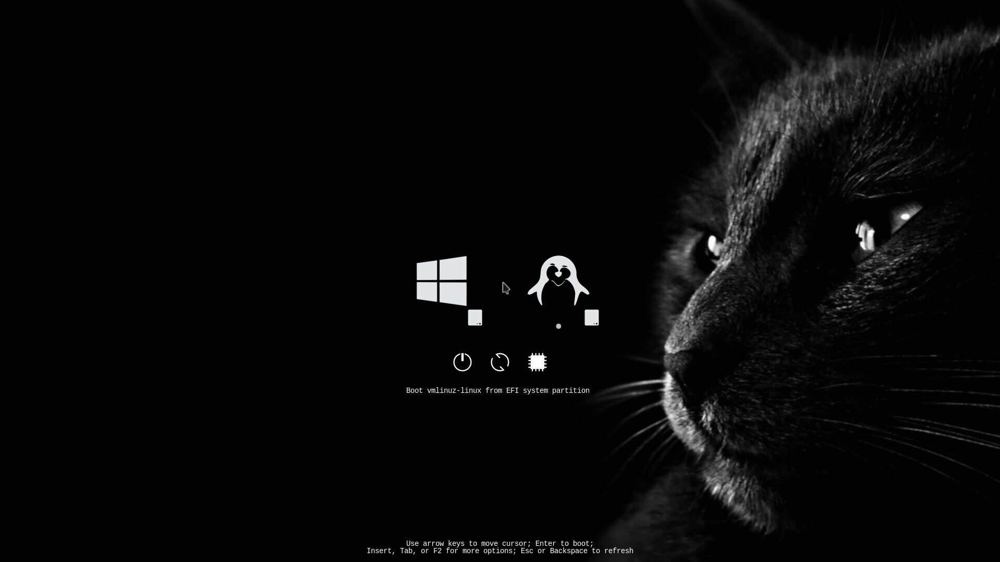
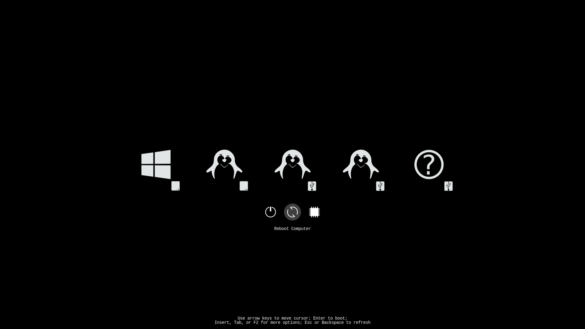

# BlackCatMuzzle-rEFInd

## [rEFInd](http://www.rodsbooks.com/refind/) is a simplistic boot manager for UEFI-based systems. This is a clean, dark and cute theme for it.
    
### Screenshots




### Usage
1. Locate your refind EFI directory. This is commonly `/boot/EFI/refind` though it will depend on where you mount your ESP and where rEFInd is installed.

2. Create a folder called `themes` inside it, if it doesn't already exist.

3. Clone this repository, [customize](https://www.rodsbooks.com/refind/configfile.html) `BlackCatMuzzle/theme.conf` if needed. E.g. you can change the default banner with cat to the fully black one by changing the appropriate line in `theme.conf` like this:
   ```
   banner themes/BlackCatMuzzle/bg/background_empty.png
   ```

4. Copy the `BlackCatMuzzle` folder into `themes` directory.

5. Add the following line at the end of `refind.conf`:
   ```
   include themes/BlackCatMuzzle/theme.conf
   ```

### Attribution
BlackCatMuzzle combines some parts of other themes:
- [LightAir / darkmini](https://github.com/LightAir/darkmini) — most of icons
- [samuelmeuli / refind-theme-dark](https://github.com/samuelmeuli/refind-theme-dark) — big selection
- [quantrancse / rEFInd-minimal-themes](https://github.com/quantrancse/rEFInd-minimal-themes) — icons of shutdown, reboot, firmware etc

